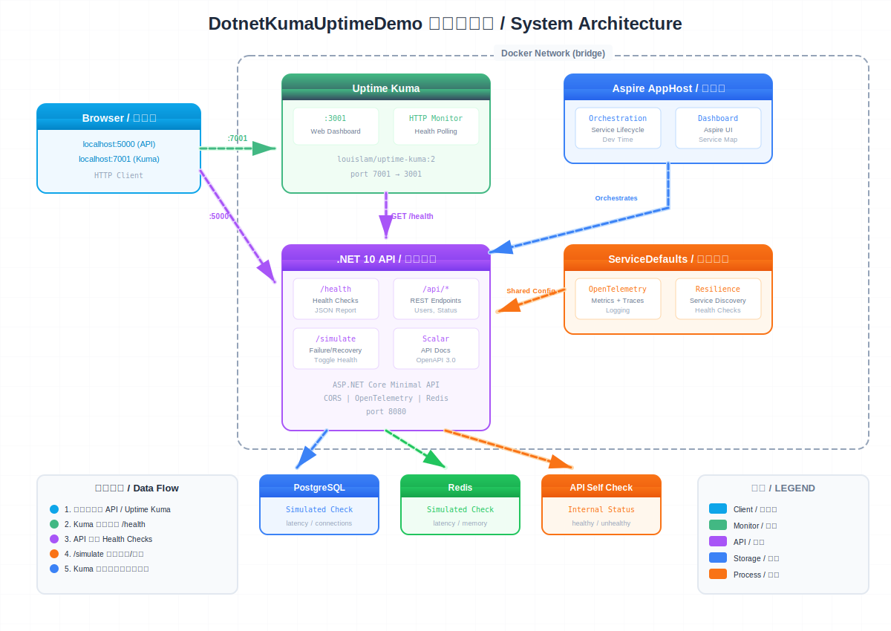

# DotnetKumaUptimeDemo

.NET 10 ASP.NET Core demo app integrated with [Uptime Kuma](https://github.com/louislam/uptime-kuma) for uptime monitoring, featuring custom health checks with failure/recovery simulation.

## Architecture



## Quick Start

### Docker Compose (Recommended)

```bash
docker-compose up --build
```

- API: http://localhost:5000
- Uptime Kuma: http://localhost:7001

### Local Development

```bash
dotnet restore DotnetKumaUptimeDemo.slnx
dotnet build DotnetKumaUptimeDemo.slnx
dotnet run --project DotnetKumaUptimeDemo
```

- API: http://localhost:5192

### Aspire Orchestration

```bash
dotnet run --project DotnetKumaUptimeDemo.AppHost
```

## Project Structure

| Project | Description |
|---------|-------------|
| **DotnetKumaUptimeDemo** | Main web API with health checks and simulation endpoints |
| **DotnetKumaUptimeDemo.AppHost** | .NET Aspire orchestrator |
| **DotnetKumaUptimeDemo.ServiceDefaults** | Shared service defaults (OpenTelemetry, resilience, service discovery) |

## API Endpoints

| Method | Endpoint | Description |
|--------|----------|-------------|
| GET | `/health` | Full health report (JSON) |
| GET | `/health/database` | Database-tagged checks |
| GET | `/health/cache` | Cache-tagged checks |
| GET | `/api/users` | Sample API (respects health state) |
| GET | `/api/status` | Service info |
| POST | `/api/simulate/failure?component=postgres\|redis\|api` | Simulate component failure |
| POST | `/api/simulate/recovery?component=postgres\|redis\|api` | Recover from simulated failure |

## Configure Uptime Kuma

1. Open http://localhost:7001 and create admin account
2. Add a new monitor:
   - Type: HTTP(s)
   - URL: `http://dotnet-kuma-api:8080/health` (within Docker network)
3. (Optional) Set up notification channels
4. Create a status page

## Tech Stack

- .NET 10 / ASP.NET Core
- .NET Aspire 13.1
- Scalar (API documentation)
- StackExchange.Redis
- Npgsql (PostgreSQL)
- OpenTelemetry
- Uptime Kuma 2
- Docker Compose
